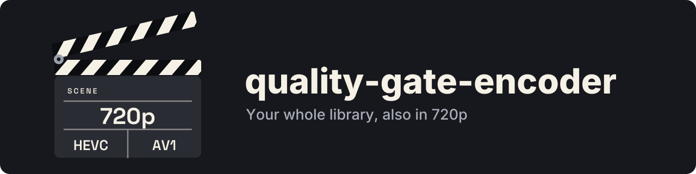

<p align="center">
  
</p>

<p align="center">
  <strong>The encoder of Quality Gate: automatic 720p versions of a Jellyfin library</strong>
</p>

<p align="center">
  <a href="https://github.com/GeiserX/quality-gate-encoder/blob/main/LICENSE"></a>
  <a href="https://hub.docker.com/r/drumsergio/quality-gate-encoder"></a>
  <a href="https://github.com/GeiserX/quality-gate-encoder/releases"></a>
  <a href="https://hub.docker.com/r/drumsergio/quality-gate-encoder"></a>
  <a href="https://codecov.io/gh/GeiserX/quality-gate-encoder"></a>
  <a href="https://github.com/awesome-jellyfin/awesome-jellyfin#readme"></a>
</p>

---

**quality-gate-encoder** is the encoder of [Quality Gate](https://github.com/GeiserX/quality-gate), the Jellyfin plugin. It monitors your media library and automatically transcodes videos to optimized 720p HEVC, H.264, or AV1 for bandwidth-efficient mobile and remote streaming. It runs as a Docker container, supports NVIDIA NVENC and Intel QSV hardware acceleration with automatic software fallback, and uses polling-based observation compatible with NFS, CIFS, and other network filesystems.

> **Formerly jellyfin-encoder.** The image moved to `drumsergio/quality-gate-encoder`. Every release is also published as `drumsergio/jellyfin-encoder` until 2027-03-31, and those images log a notice at startup; after that date the old name stays pullable but gets no new versions.

## Features

- **Automatic folder monitoring** -- watches source directories for new, renamed and deleted files using polling (NFS/CIFS compatible)
- **Hardware-accelerated encoding** -- NVIDIA NVENC and Intel Quick Sync Video (QSV), with transparent software fallback (libx265 / libx264 / libsvtav1)
- **Smart skip logic** -- detects files already at 720p or lower via filename heuristics and ffprobe resolution analysis
- **Jellyfin multi-version support** -- creates version symlinks so Jellyfin presents both original and transcoded copies to the user
- **H.264 / AAC / MP4 output** -- set `ENCODING_CODEC: "h264"` for MP4 output that Jellyfin clients direct play without transcoding, and without re-encoding the library you already have (see [H.264, AAC and MP4 Output](#h264-aac-and-mp4-output))
- **Audio normalization** -- re-encodes audio for consistent playback: AAC keeping up to 5.1 for MP4, stereo AC3 at 192 kbps for MKV
- **Subtitle preservation** -- copies MKV-native subtitle codecs and converts incompatible ones (MOV text, WebVTT) to SRT; converts text subtitles to `mov_text` for MP4
- **Guarded automatic cleanup** -- periodically removes orphaned encodes and stale symlinks with mount-health checks to prevent mass deletion (see [Safety & Cleanup](#safety--cleanup) below)
- **Temp-file workflow** -- encodes to `.tmp` and atomically renames on success, so Jellyfin never indexes incomplete files (note: no cross-container locking — avoid pointing two encoders at the same destination subfolder)
- **Configurable quality presets** -- LOW, MEDIUM, and HIGH profiles with per-codec CQ/CRF tuning

## Quick Start

### Docker Compose

```yaml
services:
  quality-gate-encoder:
    image: drumsergio/quality-gate-encoder:1.5.6
    container_name: quality-gate-encoder
    devices:
      - /dev/dri:/dev/dri  # Intel QSV -- remove if using NVIDIA or software encoding
    volumes:
      - /path/to/source:/app/source
      - /path/to/destination:/app/destination
    environment:
      ENABLE_HW_ACCEL: "true"
      HW_ENCODING_TYPE: "intel"   # nvidia | intel
      ENCODING_QUALITY: "LOW"     # LOW | MEDIUM | HIGH
      ENCODING_CODEC: "hevc"      # hevc | av1
      POLL_INTERVAL: "60"         # seconds between scans of the source tree
    restart: always

    # For NVIDIA GPU support, replace the devices block above with:
    # deploy:
    #   resources:
    #     reservations:
    #       devices:
    #         - capabilities: [gpu]
```

### Docker CLI

```bash
docker run -d \
  --name quality-gate-encoder \
  --device /dev/dri:/dev/dri \
  -v /path/to/source:/app/source \
  -v /path/to/destination:/app/destination \
  -e ENABLE_HW_ACCEL=true \
  -e HW_ENCODING_TYPE=intel \
  -e ENCODING_CODEC=hevc \
  -e ENCODING_QUALITY=LOW \
  -e POLL_INTERVAL=60 \
  --restart always \
  drumsergio/quality-gate-encoder:1.5.6
```

## Configuration

All settings are controlled via environment variables.

| Variable | Default | Description |
|---|---|---|
| `SOURCE_FOLDER` | `/app/source` | Path to the directory containing original videos |
| `DEST_FOLDER` | `/app/destination` | Path to the directory for encoded output |
| `ENABLE_HW_ACCEL` | `true` | Enable hardware-accelerated encoding |
| `HW_ENCODING_TYPE` | `nvidia` | Hardware encoder: `nvidia` or `intel` |
| `HW_DECODE` | `true` | Decode and scale on the GPU as well as encode; `false` decodes and scales in software (see [Decoding on the GPU](#decoding-on-the-gpu)) |
| `ENCODING_CODEC` | `hevc` | Output codec: `hevc`, `h264`, or `av1` |
| `OUTPUT_CONTAINER` | `auto` | Container: `auto` (MP4 for H.264, MKV otherwise), `mkv`, or `mp4` |
| `ENCODING_QUALITY` | `LOW` | Quality preset: `LOW`, `MEDIUM`, or `HIGH` |
| `AUDIO_CODEC` | `auto` | Audio codec: `auto` (AAC for MP4, AC3 for MKV), `aac`, or `ac3` |
| `AUDIO_BITRATE` | `auto` | Bitrate per audio track: `auto` (192k stereo, 384k multichannel) or a value such as `256k` |
| `AUDIO_CHANNELS` | `auto` | Channels per audio track: `auto` (AAC keeps up to 5.1, AC3 downmixes to stereo) or a count such as `2` |
| `SYMLINK_TARGET_PREFIX` | _(empty)_ | Absolute path prefix for Jellyfin version symlinks (same-host mode) |
| `SYMLINK_MANIFEST_TARGET` | _(empty)_ | Path prefix for cross-host manifest-based symlinks (see [Cross-Host Setup](#cross-host-manifest-mode)) |
| `SYMLINK_VERSION_SUFFIX` | ` - 720p` | Suffix appended to symlink filenames |
| `CLEANUP_INTERVAL_HOURS` | `6` | Hours between automatic orphan cleanup runs |
| `POLL_INTERVAL` | `60` | Seconds the folder watcher waits between scans of the source tree (see [Polling interval](#polling-interval)) |
| `DEST_MIN_FREE_GB` | `0` | Free-space floor for the destination, in GB: encodes wait while the destination filesystem has less than this free (see [Free-space floor](#free-space-floor)) |
| `FFMPEG_LOGLEVEL` | `warning` | What FFmpeg writes to the container log during an encode (see [FFmpeg log level](#ffmpeg-log-level)) |
| `PRIORITY_FILE` | `$SOURCE_FOLDER/.encoder-priority.json` | JSON list of source paths to encode before the rest (see [Priority list](#priority-list)) |
| `PRIORITY_MAX_AGE_HOURS` | `0` | Hours a priority list counts after its `generated` time; older lists are ignored. `0` turns the check off (see [Priority list](#priority-list)) |

## Quality Presets

Each preset defines constant-quality (CQ) values for hardware encoding and constant rate factor (CRF) values for software fallback.

| Preset | HEVC CQ / CRF | H.264 CQ / CRF | AV1 CQ / CRF | Intended Use |
|---|---|---|---|---|
| **LOW** | 32 / 30 | 28 / 26 | 45 / 40 | Mobile devices, minimal storage footprint |
| **MEDIUM** | 26 / 26 | 24 / 23 | 35 / 35 | Balanced quality and file size |
| **HIGH** | 22 / 22 | 21 / 20 | 28 / 28 | Higher fidelity, larger files |

## H.264, AAC and MP4 Output

Set `ENCODING_CODEC: "h264"` and new encodes come out as H.264 video with AAC audio in an MP4 container. Nothing else about the setup changes.

| Aspect | What you get |
|---|---|
| Video encoder | `h264_qsv` (Intel), `h264_nvenc` (NVIDIA), `libx264` (software fallback) |
| Container | `.mp4`, with the index written at the front so players can start before reading the whole file |
| Audio | AAC, source channel layout up to 5.1, at 192 kbps stereo or 384 kbps multichannel |
| Pixel format | Forced to 8-bit `yuv420p`, so 10-bit sources encode instead of failing on hardware H.264 |

`hevc` and `av1` still produce `.mkv` with the stereo AC3 audio they always have. To pair a codec with a different container, set `OUTPUT_CONTAINER` explicitly.

### Switching codec never re-encodes what you already have

Changing `ENCODING_CODEC` on a library that is already encoded produces zero re-encodes.

An output on disk counts as done whatever container it is in. If your destination is full of `Movie - 720p.mkv` files and you switch to `ENCODING_CODEC: "h264"`, the encoder leaves those files alone. It picks up only the titles that have no encode at all, and those come out as `.mp4`. Switching back to `hevc` works the same way in reverse, respecting the `.mp4` outputs you already have.

The skip check, orphan cleanup, the symlink manifest, and source-deletion handling all match on the filename stem rather than the extension. A destination folder holding a mix of `.mkv` and `.mp4` works fine, so the two formats can coexist for as long as you like.

### Subtitles in MP4

MP4 carries text subtitles only. The encoder converts text tracks (SRT, ASS/SSA, WebVTT) to `mov_text` and drops bitmap tracks (PGS, DVB), which have no MP4 equivalent. Keep external `.srt` sidecars next to the encode if you need those. If FFmpeg fails with subtitles mapped, the encoder retries once without them. A subtitle track FFmpeg cannot handle costs you the subtitles, never the encode.

## Hardware Acceleration

### NVIDIA (NVENC)

Requires the [NVIDIA Container Toolkit](https://docs.nvidia.com/datacenter/cloud-native/container-toolkit/latest/install-guide.html). Add a GPU reservation to your Compose file:

```yaml
deploy:
  resources:
    reservations:
      devices:
        - capabilities: [gpu]
```

Set `HW_ENCODING_TYPE: "nvidia"`. Supported encoders: `hevc_nvenc`, `h264_nvenc`, `av1_nvenc`.

### Intel (Quick Sync Video)

Pass the render device into the container:

```yaml
devices:
  - /dev/dri:/dev/dri
```

Set `HW_ENCODING_TYPE: "intel"`. Supported encoders: `hevc_qsv`, `h264_qsv`, `av1_qsv`.

### Decoding on the GPU

With a hardware encoder, the source is decoded and scaled to 720p on the same GPU, so the frames never pass through the CPU. Intel uses `-hwaccel qsv` with `scale_qsv`, NVIDIA uses `-hwaccel cuda` with `scale_cuda`. The encoder settings are the same as on the software path. For H.264 output the GPU converts to 8-bit 4:2:0 (`nv12`), so 10-bit sources still produce 8-bit H.264; HEVC and AV1 keep the source bit depth, as they do in software.

On 1080p sources this cut the CPU time of an encode by 10 to 16 times on an Intel iGPU, and by about 40 times on an NVIDIA card.

Every file still gets its encode:

- A source in a codec the GPU does not decode (for example MPEG-4 Part 2, which covers Xvid and DivX, on Intel) is decoded in software from the start.
- A source with a display rotation (a phone video shot in portrait, say) is decoded in software too. FFmpeg does not rotate GPU frames, so the encode would come out sideways.
- If the GPU run fails, or its output fails verification, the file is encoded again straight away with software decoding and scaling. This covers profiles the card refuses, such as 10-bit H.264.
- An FFmpeg run whose output file has not grown for 10 minutes is killed and counts as failed, so a GPU that stops answering falls back to software instead of holding the worker forever. A slow encode still writes every few seconds and is never stopped.
- Verification on both paths also compares the encode's video length with the source's, because FFmpeg exits 0 when a decoder gives up part way. A video more than 2 s or 0.5% short fails. When the source has no per-stream length (some Matroska files lack the `DURATION` tag), that check is skipped rather than read the whole file.

The log says which path each file took (`Encoding succeeded (hardware decode)` or `(software decode)`) and why a fallback happened. Set `HW_DECODE: "false"` to decode and scale in software as releases before this one did.

### Software Fallback

If hardware acceleration is disabled or unavailable, the encoder falls back to `libx265` (HEVC), `libx264` (H.264), or `libsvtav1` (AV1) using CRF-based quality control. Worker count scales to the number of available CPU cores.

## Safety & Cleanup

The encoder periodically removes orphaned encodes (files in `DEST_FOLDER` with no matching source) and stale version symlinks. Several safety rails prevent accidental mass deletion:

| Guard | Scope | Behavior |
|---|---|---|
| **Source not accessible** | `cleanup_destination`, `cleanup_orphaned_symlinks` | Aborts if `SOURCE_FOLDER` is not a directory |
| **Empty source** | `cleanup_destination` | Aborts if zero video files are found in source |
| **Persisted count** (primary) | `cleanup_destination`, `cleanup_orphaned_symlinks` | After each successful cleanup, the source video count is written to `DEST_FOLDER/.encoder_source_count`. If the current count drops below 50% of the persisted value, cleanup is refused. To reset after intentionally shrinking the library, delete the `.encoder_source_count` file. |
| **Source vs destination ratio** (secondary) | `cleanup_destination`, `cleanup_orphaned_symlinks` | If source video count is less than 50% of destination encode count, cleanup is refused |
| **Mount health on delete events** | `VideoHandler.on_deleted` | Before trusting a file-delete event from the polling observer, the handler verifies the source mount is responsive. If not, the event is ignored. |
| **Growing tmp files** | `cleanup_destination` | `.tmp` files are kept if they are still being written |

**Same-folder mode** (`SOURCE_FOLDER == DEST_FOLDER`): versioned output filenames (e.g., `Movie - 720p.mkv` or `Movie - 720p.mp4`) are recognized as valid encodes and excluded from orphan cleanup.

**Delete-event rate limiter**: If more than 50 delete events fire within 60 seconds, further deletes are suppressed. This prevents mount outages from cascading into mass encode deletion. The limit resets automatically after the window expires.

**Limitations**: The persisted-count and ratio guards use a 50% threshold. A mount that exposes more than half its files will pass both guards, potentially allowing cleanup of files in invisible subtrees. After bulk intentional deletions, you may need to delete `DEST_FOLDER/.encoder_source_count` to reset the baseline — cleanup will refuse to run until the persisted count is reset or the source count recovers above 50%.

### Restarts on a caught-up library

Every container start submits every source again. A source whose encode already exists is
skipped after a look at the destination and a validation of the existing output, without
probing the source, so a restart on a library of tens of thousands of files costs local
destination checks per source rather than hours of metadata reads against the file server
that holds the originals.

### Free-space floor

`DEST_MIN_FREE_GB=1000` makes the encoder hold each new encode while the destination filesystem has less than 1 TB free, re-check every five minutes, and carry on by itself when space returns. Encodes already running finish, and the floor is checked again after the wait for a still-growing source, right before ffmpeg starts. If the free space cannot be read at all, the encode proceeds and ffmpeg reports whatever is really wrong, so the floor is a courtesy to the disk's other tenants, not a guarantee against ENOSPC. Use it when the destination shares a disk with something that must never see ENOSPC, such as an object store node or a database. The default `0` keeps the old behaviour: encode until the disk is full.

### Priority list

At every start the encoder queues every source in the order the folder walk finds them, so
on a large library the next episode of a show people are watching can sit thousands of files
down the queue. `PRIORITY_FILE` lets something outside the encoder put those first. The
encoder only reads it, so it can live on a read-only source mount.

```json
{
  "generated": "2026-01-01T00:00:00Z",
  "paths": [
    "Show A (2001)/Season 02/",
    "Film B (2002)/Film B (2002).mkv",
    "Show C (2003)/"
  ]
}
```

- The file is UTF-8 JSON. A leading byte order mark, as some Windows tools write, is fine.
- Each entry is a path relative to `SOURCE_FOLDER`: a folder (ends with `/`) or one file.
  The list is in priority order, highest first.
- A queued file belongs to the first entry that is its own path or a folder holding it.
  Matching is on whole path components, so `Show A/` covers `Show A/S01/E01.mkv` and not
  `Show AB/S01/E01.mkv`.
- Both sides are compared in Unicode NFC, so an accented name matches whether the list or
  the filesystem spells `é` as one character or as `e` plus a combining accent. Nothing else
  is folded: `show a/` does not match `Show A/`.
- Files of an earlier entry encode before files of a later one. Within one entry they go in
  path order, so `S01E01` comes before `S01E02`. Files no entry covers go last, in the order
  they were queued.
- Before each pick the encoder checks the file's modification time and size, and re-reads it
  when either changed. A new list re-orders what is still waiting; encodes already running
  finish. A file the watcher finds later goes straight to its place in the order.
- A missing, unreadable, empty or invalid file changes nothing. The queue runs in the order
  files were found, as it did before this setting existed, and the encoder logs each change
  of state once, not on every pick.
- `PRIORITY_MAX_AGE_HOURS` guards against a producer that stopped running. When it is above
  `0`, a list whose `generated` time is older than that many hours counts as absent, and so
  does a list whose `generated` is missing or is not an ISO 8601 extended time, with a `T`
  between date and time and a `Z` or UTC offset (`2026-01-01T00:00:00Z`,
  `2026-01-01T01:00:00+01:00`). The age is checked at every
  pick, so a list expires without being touched, and it counts again once it is rewritten
  with a recent time. The log says why the list was set aside, once per change. A producer
  should rewrite the file at least once a day, and the setting should leave room for a
  missed run: with a daily producer, `48` survives one failure and ignores the list after
  the second. The default `0` never reads `generated`.

At startup, and on every reload, the log says how many waiting files the list matched and
which one runs first:

```
Priority list /app/source/.encoder-priority.json: 3 entries, 42 of 51876 pending files match; first: Show A (2001)/Season 02/S02E05.mkv
```

### FFmpeg log level

At `warning`, the default, FFmpeg prints nothing for a healthy encode and everything it
complains about for a failing one. The encoder's own lines stay either way: the full command
it ran, `Encoding succeeded:` with the finished path, and `FFmpeg encoding failed (exit N)`
with the code FFmpeg died on.

The encoder used to run FFmpeg at `verbose`, which redraws a progress line twice a second.
Python reads FFmpeg's output in text mode, where the carriage return that redraws the line
counts as a newline, so every redraw became a log record of its own. A Docker json-file log
at the default few megabytes then held a few hours, and anything older was gone before
anyone went looking for it.

Set `FFMPEG_LOGLEVEL=verbose` on one container when a single file needs the full FFmpeg dump.
The nine level names work: `quiet`, `panic`, `fatal`, `error`, `warning`, `info`, `verbose`,
`debug`, `trace`. FFmpeg's numeric levels and its flag syntax, `repeat+level+verbose`, are
not passed through. Anything outside the nine falls back to `warning` and logs a line naming
what it takes, because a level FFmpeg does not know makes it exit before it opens the input,
which would fail every encode.

### Upgrading from < 1.1.0

Starting with v1.1.0, encoded outputs always include the version suffix (e.g., `Movie - 720p.mkv` instead of `Movie.mkv`). Existing encodes without the suffix will be re-encoded. To avoid this, rename them before upgrading:

```bash
# Dry-run (shows what would be renamed)
docker exec quality-gate-encoder python /app/scripts/migrate_encode_names.py

# Apply renames
docker exec quality-gate-encoder python /app/scripts/migrate_encode_names.py --apply
```

### Upgrading to 1.4.0

Two behaviours change for an existing install; both are described under
[Polling interval](#polling-interval).

- The source tree is scanned every 60 seconds instead of every second. Set
  `POLL_INTERVAL=1` to keep the old cadence.
- A video renamed inside the source tree, or a renamed folder, is now handled within one
  poll. Before, it waited for the next container restart. Since 1.5.2 the finished encode
  moves with it; 1.4.0 through 1.5.1 re-encoded it under the new name.

## Cross-Host Manifest Mode

When the encoder and Jellyfin run on **different hosts** (e.g., encoder on a NAS, Jellyfin on another server connected via CIFS/SMB), real symlinks cannot be created over the network mount. The manifest mode solves this:

1. **Encoder** writes a `.symlink-manifest.json` to `DEST_FOLDER` listing all encoded files and their Jellyfin container target paths.
2. **Jellyfin host** reads the manifest via a CIFS mount and creates real local symlinks.

### Encoder Configuration

Set `SYMLINK_MANIFEST_TARGET` to the path prefix as seen **inside the Jellyfin container**:

```yaml
services:
  quality-gate-encoder:
    image: drumsergio/quality-gate-encoder:1.5.6
    environment:
      SYMLINK_MANIFEST_TARGET: "/media-720/Peliculas"  # Jellyfin container path
      # ...other settings
```

The manifest is updated on encode, delete, and cleanup, and fully rebuilt at startup.

### Jellyfin Host

Install `scripts/symlink-from-manifest.sh` on the Jellyfin host and run it via cron:

```bash
# Copy script to Jellyfin host
cp scripts/symlink-from-manifest.sh /boot/config/symlink-from-manifest.sh
chmod +x /boot/config/symlink-from-manifest.sh

# Add cron (runs every 5 minutes)
echo '*/5 * * * * /boot/config/symlink-from-manifest.sh' | crontab -
```

Edit the script's configuration variables (`REMOTE_ROOT`, `MEDIA_ROOT`, `LIBRARIES`) to match your setup. The script creates symlinks in `MEDIA_ROOT` pointing to the Jellyfin container path from the manifest, and removes orphaned symlinks not present in the manifest.

### Manifest Format

```json
{
  "version": 1,
  "symlinks": {
    "Movie (2024)/Movie (2024) - 720p.mkv": "/media-720/Peliculas/Movie (2024)/Movie (2024) - 720p.mkv"
  }
}
```

### Same-Host vs Cross-Host

| Mode | Variable | Use Case |
|---|---|---|
| **Same-host** | `SYMLINK_TARGET_PREFIX` | Encoder and Jellyfin share a filesystem — encoder creates real symlinks directly |
| **Cross-host** | `SYMLINK_MANIFEST_TARGET` | Encoder and Jellyfin on different hosts — encoder writes manifest, Jellyfin host creates symlinks |

Both modes can coexist. If only `SYMLINK_MANIFEST_TARGET` is set, symlinks are managed exclusively via the manifest.

## Architecture

```
Source folder (polling observer)
        |
        v
  New or renamed file detected ──> Wait for file completion (size-stable for 60s)
        |
        v
  Resolution check ──> Skip if <= 720p
        |
        v
  FFmpeg transcode ──> scale to 720p, encode video and audio, copy/convert subtitles
        |
        v
  Verify output (ffprobe duration check)
        |
        v
  Atomic rename .tmp -> .mkv/.mp4 ──> Create Jellyfin version symlink (optional)
```

Key design decisions:

- **Polling observer** (`watchdog.PollingObserver`) instead of inotify, ensuring compatibility with NFS, CIFS, and other network filesystems.
- **Temp-file workflow** -- encodes to a `.tmp` file first and atomically renames on success, preventing Jellyfin from indexing incomplete files.
- **File-growth detection** -- before deleting stale `.tmp` files, the cleanup routine checks whether the file is still being written by another instance.
- **ProcessPoolExecutor behind a priority queue** -- one worker for hardware encoding (GPU is the bottleneck), multiple workers for software encoding (CPU-bound). Files wait in the encoder's own queue, and a dispatcher thread hands the executor the next one by [priority](#priority-list) whenever a worker frees up, so the executor never holds more than it can run.
- **Container-agnostic output lookup** -- an encode is located by filename stem across every container the tool writes, so changing codec or container never re-encodes a library that is already done.

### Polling interval

Every poll takes a snapshot of the whole source tree: one `stat` for every file and folder
under `SOURCE_FOLDER`. The watcher waits `POLL_INTERVAL` seconds, takes the snapshot, and
reports what changed since the previous one. A new file is therefore noticed within one
interval plus one snapshot.

On a local disk a snapshot is cheap. On a network share holding tens of thousands of files it
is not: a snapshot of a 54k-entry CIFS tree took about 80 seconds, and with the old
one-second wait the file server answered around 1,500 metadata requests per second around
the clock for nothing. `POLL_INTERVAL` defaults to 60. Raise it to 300 or 600 for a large
library on NFS or CIFS; encoding one film takes longer than any of these intervals, so the
wait never decides throughput. A value that is not a number, not above zero, or above
86400 logs a warning and falls back to 60. The startup `Config:` line prints the value in
use.

The watcher matches files by inode, so a rename inside the source tree arrives as a move: a
download finishing its rename from `.part` or `.!qB` into `.mkv`, a folder renamed by hand,
or a file renamed by hand is handled within one poll. A finished encode follows its source:
it is renamed in the destination, the manifest entry and the version symlink move with it,
and nothing is encoded again, so renaming a whole folder costs a rename per file. A source
is encoded under the new name only when its encode is missing, still being written, or
cannot be renamed in place, for instance across filesystems. A file copied in from outside is
a plain create and is handled the same way.

## Utilities

### compare_encodes.py

A standalone diagnostic script that compares source and destination folders to report encoding coverage.

```bash
# Command-line usage
python scripts/compare_encodes.py --source /media/movies --dest /media/movies-720p

# Inside a running container
docker exec quality-gate-encoder python /app/scripts/compare_encodes.py

# Output as JSON or CSV
python scripts/compare_encodes.py -s /media/movies -d /media/movies-720p --format json
python scripts/compare_encodes.py -s /media/movies -d /media/movies-720p --format csv

# Include files that were skipped (already 720p or lower)
python scripts/compare_encodes.py -s /media/movies -d /media/movies-720p --show-skipped
```

| Option | Env Variable | Description |
|---|---|---|
| `-s, --source` | `SOURCE_FOLDER` | Source folder with original videos |
| `-d, --dest` | `DEST_FOLDER` | Destination folder with encoded videos |
| `-f, --format` | `OUTPUT_FORMAT` | Output format: `text`, `json`, `csv` |
| `--show-skipped` | `SHOW_SKIPPED` | Include skipped low-quality files in the report |
| `--ignore` | `IGNORE_PATTERNS` | Additional regex patterns to ignore (comma-separated) |

<details>
<summary>Example output</summary>

```
================================================================================
ENCODING COMPARISON REPORT
================================================================================

Source folder:      /media/movies
Destination folder: /media/movies-720p

----------------------------------------
SUMMARY
----------------------------------------
Total source files:     4,463
Total destination files: 4,440
Matched (encoded):      4,420
Missing encodes:        23
Orphaned encodes:       20
Skipped (low quality):  20

----------------------------------------
MISSING ENCODES (23 files, 45.2 GiB total)
----------------------------------------
  [   2.1 GiB] Movie Title (2024) [BDRemux 1080p].mkv
  [   1.8 GiB] Another Movie (2023) [UHD 2160p].mkv
  ...

================================================================================
STATUS: Issues found - 23 missing encodes, 20 orphaned files
================================================================================
```

</details>

## Other Jellyfin Projects by GeiserX

- [quality-gate](https://github.com/GeiserX/quality-gate) — Restrict users to specific media versions based on filename regex patterns; this encoder builds the 720p versions it serves
- [smart-covers](https://github.com/GeiserX/smart-covers) — Cover extraction for books, audiobooks, comics, magazines, and music libraries with online fallback
- [whisper-subs](https://github.com/GeiserX/whisper-subs) — Automatically generates subtitles using local AI models powered by Whisper
- [jellyfin-telegram-channel-sync](https://github.com/GeiserX/jellyfin-telegram-channel-sync) — Sync Jellyfin access with Telegram channel membership

## Related Music Pipeline Tools

- [telegram-slskd-local-bot](https://github.com/GeiserX/telegram-slskd-local-bot) — Automated music discovery and download via Telegram
- [slskd-transform](https://github.com/GeiserX/slskd-transform) — Bulk upgrade lossy to lossless FLAC via Soulseek
- [audio-transcode-watcher](https://github.com/GeiserX/audio-transcode-watcher) — Automated multi-format audio transcoding


## Contributing

Contributions are welcome. Please open an issue to discuss proposed changes before submitting a pull request.

1. Fork the repository
2. Create a feature branch (`git checkout -b feature/my-change`)
3. Commit your changes
4. Open a pull request against `main`


## License

This project is licensed under the [GPL-3.0 License](LICENSE).
