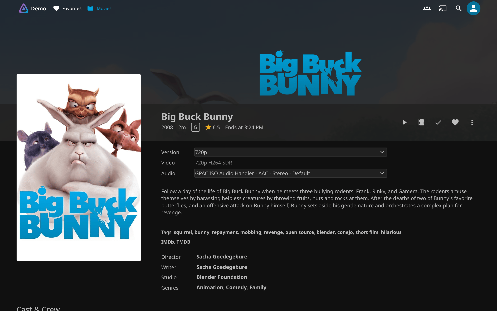
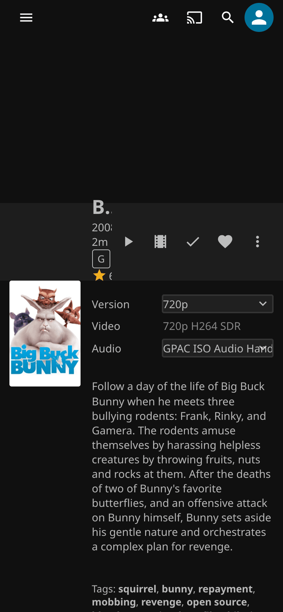
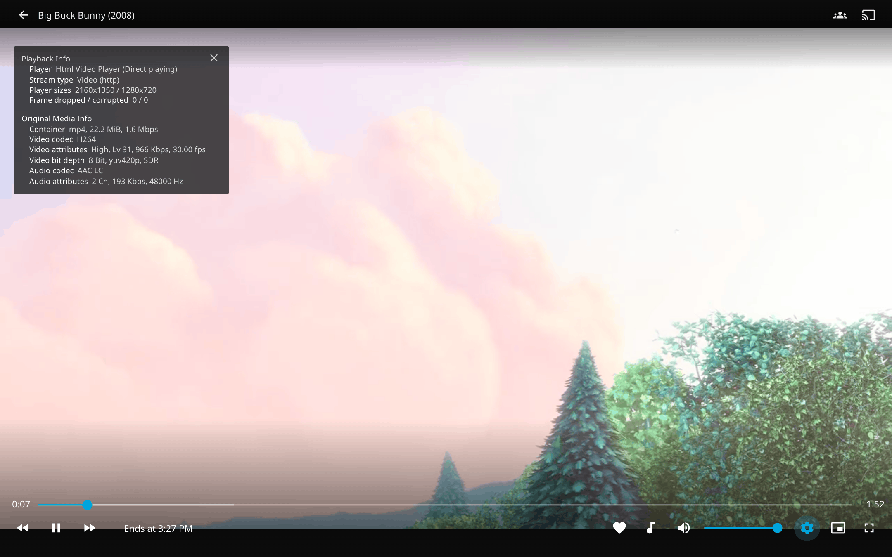
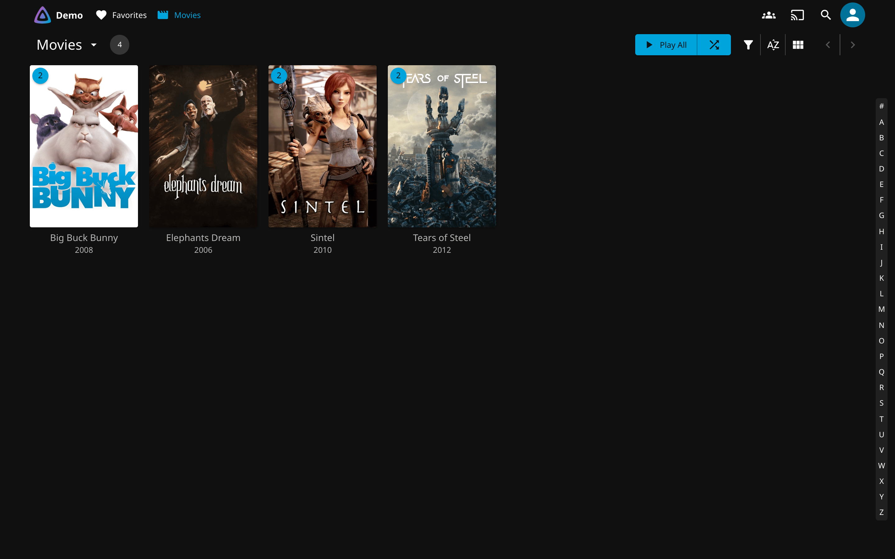

---
hide:
  - navigation
---

# quality-gate-encoder { .qge-visually-hidden }

  

  
  
  
  

---

**quality-gate-encoder** watches a Jellyfin library and adds a 720p copy beside every film and episode, so phones and remote viewers direct play the copy instead of making the server transcode live for each stream. Jellyfin's own answer is to transcode on the fly, once per viewer, every time; tools that re-encode a library usually replace the original. This keeps the original untouched and Jellyfin lists the copy as a second version of the same title. Start with [Getting started](getting-started.md), then check [what you see when it worked](getting-started.md#what-you-see-when-it-worked). The [Quality Gate](https://github.com/GeiserX/quality-gate) plugin is optional: it caps chosen users at the 720p copy and tells the encoder which titles to make first.

-   :material-docker: **[Getting started](getting-started.md)**

    ---

    One container, two mounts, a GPU device if you have one. Docker Compose and CLI, Intel and NVIDIA.

-   :material-check-circle-outline: **[What you see when it worked](getting-started.md#what-you-see-when-it-worked)**

    ---

    The log lines of a first run, the film's folder afterwards, and the Version menu in Jellyfin.

-   :material-clipboard-check-outline: **[Utilities](utilities.md)**

    ---

    `compare_encodes.py` reports which titles have their 720p copy, which are missing and which were skipped.

-   :material-format-list-bulleted: **[Configuration](configuration.md)**

    ---

    Every variable and its default: codec, quality preset, symlink prefix, free-space floor, priority list.

## In Jellyfin

<figure markdown>

<figcaption>On a phone</figcaption>
</figure>
<figure markdown>

<figcaption>Direct Play, no live transcode</figcaption>
</figure>
<figure markdown>

<figcaption>Each title listed once</figcaption>
</figure>

The copy is named `<title> - 720p`, the pattern Jellyfin groups as versions of one item, so the library grid does not change and the film's page grows a Version menu. Jellyfin on a different host than the encoder gets a manifest instead of symlinks: [Cross-host manifest mode](cross-host.md).

## What it does

- Keeps the original untouched and writes the copy to a destination folder you choose; the ` - 720p` link beside the original is what Jellyfin reads.
- Encodes on an Intel iGPU (QSV) or an NVIDIA card (NVENC), decodes on the same GPU, and falls back to software by itself when the GPU refuses a file.
- Output in HEVC, H.264 or AV1; H.264 comes out as MP4 with AAC for the widest direct play. Switching codec never re-encodes what exists.
- Skips anything already 720p or lower. A restart on a finished library checks the destination instead of re-reading the originals.
- Encodes the titles your viewers are about to watch first when a [priority list](configuration.md#priority-list) is written, by the Quality Gate plugin or anything else.

## How it runs

- One Docker image, `drumsergio/quality-gate-encoder`, `linux/amd64` only. Until 2027-03-31 every release is also published as `drumsergio/jellyfin-encoder`; [moving](getting-started.md#moving-from-jellyfin-encoder) is a change of image name.
- It polls the source tree instead of relying on inotify, so NFS and CIFS shares work. [How it works](how-it-works.md) has the pipeline and what a poll costs on a large share.
- Encodes go to a `.tmp` file and are renamed once verified, so Jellyfin never indexes a half-written file.
- Orphan cleanup runs every six hours by default (`CLEANUP_INTERVAL_HOURS`) behind the guards on [Safety and cleanup](safety.md): it refuses when the source looks wrong, and delete events are rate-limited.

## What it does not do

- It does not change or remove an original. What it removes is limited to its own output: orphaned encodes in the destination and stale ` - 720p` links.
- It makes one size, 720p. There is no setting for another height.
- It does not run on ARM: the image is `linux/amd64` only.
- It does not decide which users see which version. That is the [Quality Gate](https://github.com/GeiserX/quality-gate) plugin.

## Getting help

- No Version menu, every file logging `software decode`, or a priority list that is ignored: the last paragraph of [What you see when it worked](getting-started.md#what-you-see-when-it-worked), then [FFmpeg log level](configuration.md#ffmpeg-log-level) and [Priority list](configuration.md#priority-list). Then open an [issue](https://github.com/GeiserX/quality-gate-encoder/issues) with the `Config:` line from the log and the lines around the error.
- A security problem: follow the [security policy](https://github.com/GeiserX/quality-gate-encoder/blob/main/SECURITY.md), never a public issue.
- Sending a fix: [Development](development.md). The plugin and the other Jellyfin tools: [Related projects](related.md).

## License

quality-gate-encoder is released under the [GPL-3.0-or-later](https://github.com/GeiserX/quality-gate-encoder/blob/main/LICENSE) license.
